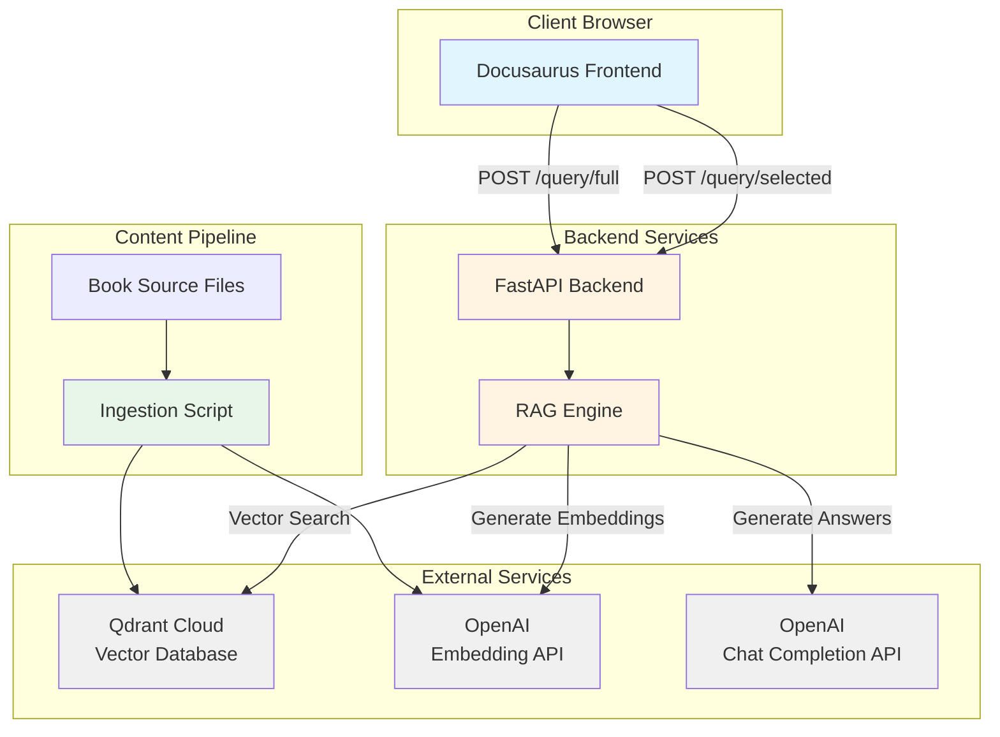
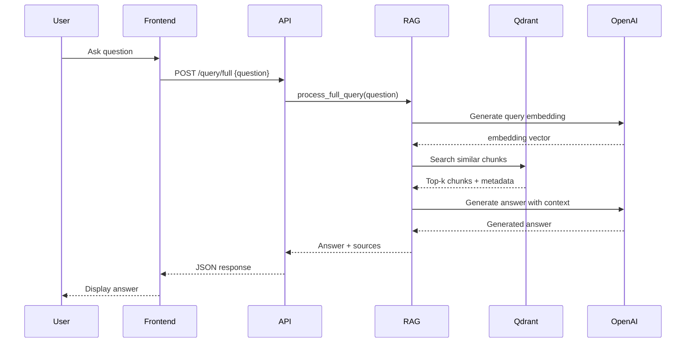
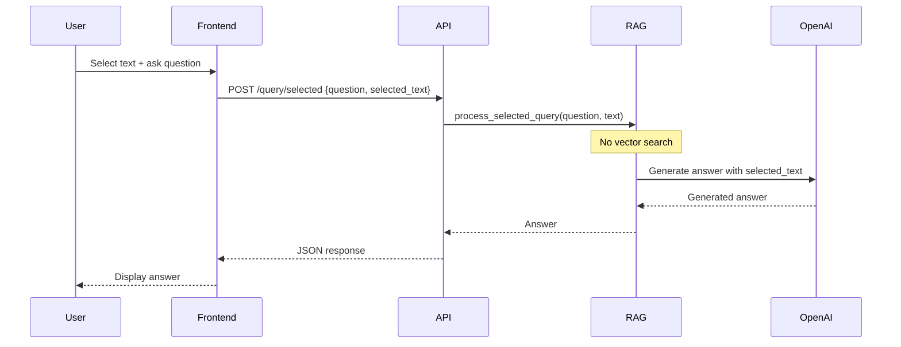
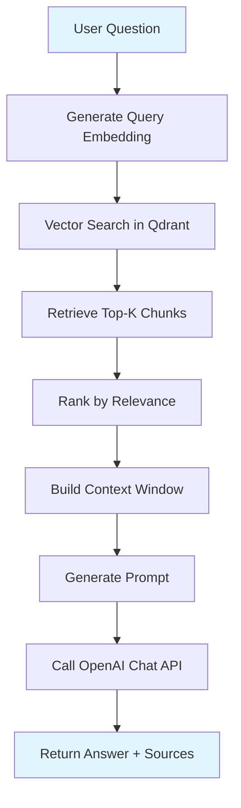
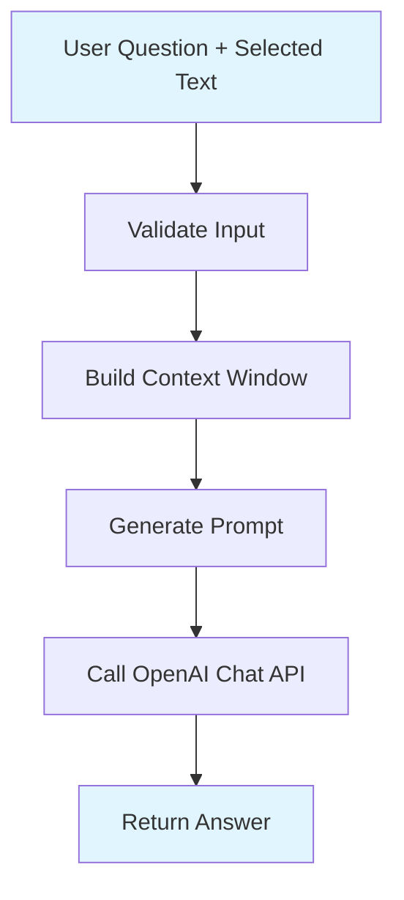
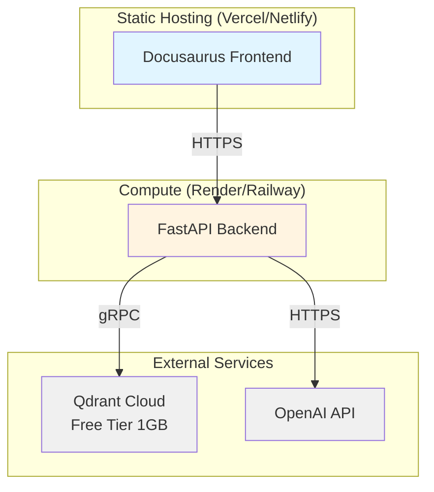

# Design Document: Technical Book RAG Chatbot

## Overview

The Technical Book RAG Chatbot is a full-stack application that combines static content hosting with intelligent question-answering capabilities. The system architecture separates concerns into three primary layers:

1. **Presentation Layer**: Docusaurus-based static site serving technical book content
2. **Application Layer**: FastAPI backend orchestrating RAG operations
3. **Data Layer**: Qdrant Cloud vector database and OpenAI services

The platform supports two distinct query modes with strict isolation:
- **Full Book Mode**: Vector similarity search across entire book content
- **Selected Text Mode**: Context-limited queries using only user-provided text

This design emphasizes cost-effectiveness (free-tier deployment), reproducibility, and clear separation of concerns between query modes.

## Architecture

### System Architecture Diagram



### Component Interaction Flow

**Full Book Query Flow:**


**Selected Text Query Flow:**


## Components and Interfaces

### Backend Folder Structure

```
backend/
├── app/
│   ├── __init__.py
│   ├── main.py                 # FastAPI application entry point
│   ├── config.py               # Configuration management
│   ├── models/
│   │   ├── __init__.py
│   │   ├── requests.py         # Pydantic request models
│   │   └── responses.py        # Pydantic response models
│   ├── services/
│   │   ├── __init__.py
│   │   ├── rag_engine.py       # RAG orchestration logic
│   │   ├── vector_store.py     # Qdrant client wrapper
│   │   ├── embedding.py        # OpenAI embedding service
│   │   └── llm.py              # OpenAI LLM service
│   ├── api/
│   │   ├── __init__.py
│   │   ├── routes.py           # API endpoint definitions
│   │   └── dependencies.py     # Dependency injection
│   └── utils/
│       ├── __init__.py
│       ├── logging.py          # Logging configuration
│       ├── errors.py           # Custom exception classes
│       └── retry.py            # Retry logic with backoff
├── scripts/
│   ├── ingest.py               # Content ingestion script
│   └── init_db.py              # Database initialization
├── tests/
│   ├── __init__.py
│   ├── test_api.py
│   ├── test_rag_engine.py
│   └── test_services.py
├── requirements.txt            # Python dependencies
├── .env.example                # Environment variable template
├── Dockerfile                  # Container definition
└── README.md                   # Setup instructions
```

### Frontend Folder Structure

```
frontend/
├── docs/
│   ├── intro.md                # Book introduction
│   ├── chapter-01/
│   │   ├── index.md
│   │   └── section-*.md
│   ├── chapter-02/
│   │   ├── index.md
│   │   └── section-*.md
│   └── ...
├── src/
│   ├── components/
│   │   ├── ChatWidget/
│   │   │   ├── index.tsx       # Main chat component
│   │   │   ├── ChatInput.tsx   # Input field component
│   │   │   ├── ChatMessage.tsx # Message display component
│   │   │   └── styles.module.css
│   │   └── TextSelector/
│   │       ├── index.tsx       # Text selection handler
│   │       └── styles.module.css
│   ├── hooks/
│   │   ├── useChat.ts          # Chat state management
│   │   └── useTextSelection.ts # Text selection logic
│   ├── services/
│   │   └── api.ts              # Backend API client
│   ├── types/
│   │   └── index.ts            # TypeScript type definitions
│   └── theme/
│       └── custom.css          # Custom styling
├── static/
│   └── img/
│       └── logo.svg
├── docusaurus.config.js        # Docusaurus configuration
├── sidebars.js                 # Sidebar navigation
├── package.json                # Node.js dependencies
├── tsconfig.json               # TypeScript configuration
└── README.md                   # Setup instructions
```

### API Endpoints

#### POST /query/full

**Purpose**: Process questions against the entire book using vector search

**Request Schema**:
```json
{
  "question": "string (1-1000 characters, required)"
}
```

**Response Schema** (200 OK):
```json
{
  "answer": "string",
  "sources": [
    {
      "chapter": "string",
      "section": "string",
      "page": "integer",
      "text_snippet": "string"
    }
  ],
  "mode": "full_book"
}
```

**Error Responses**:
- 400: Invalid request (missing/empty question, exceeds length)
- 500: Internal server error
- 503: Vector database unavailable

#### POST /query/selected

**Purpose**: Process questions using only user-selected text

**Request Schema**:
```json
{
  "question": "string (1-1000 characters, required)",
  "selected_text": "string (1-10000 characters, required)"
}
```

**Response Schema** (200 OK):
```json
{
  "answer": "string",
  "mode": "selected_text"
}
```

**Error Responses**:
- 400: Invalid request (missing fields, exceeds length)
- 500: Internal server error

#### GET /health

**Purpose**: Health check endpoint for monitoring

**Response Schema** (200 OK):
```json
{
  "status": "healthy",
  "services": {
    "vector_db": "connected",
    "openai": "available"
  }
}
```

## Data Models

### Request Models (Pydantic)

```python
# app/models/requests.py

from pydantic import BaseModel, Field, validator

class FullQueryRequest(BaseModel):
    question: str = Field(..., min_length=1, max_length=1000)
    
    @validator('question')
    def question_not_empty(cls, v):
        if not v.strip():
            raise ValueError('Question cannot be empty or whitespace')
        return v.strip()

class SelectedQueryRequest(BaseModel):
    question: str = Field(..., min_length=1, max_length=1000)
    selected_text: str = Field(..., min_length=1, max_length=10000)
    
    @validator('question', 'selected_text')
    def fields_not_empty(cls, v):
        if not v.strip():
            raise ValueError('Field cannot be empty or whitespace')
        return v.strip()
```

### Response Models (Pydantic)

```python
# app/models/responses.py

from pydantic import BaseModel
from typing import List, Optional

class Source(BaseModel):
    chapter: str
    section: str
    page: int
    text_snippet: str

class FullQueryResponse(BaseModel):
    answer: str
    sources: List[Source]
    mode: str = "full_book"

class SelectedQueryResponse(BaseModel):
    answer: str
    mode: str = "selected_text"

class ErrorResponse(BaseModel):
    error: str
    detail: Optional[str] = None

class HealthResponse(BaseModel):
    status: str
    services: dict
```

### Vector Database Schema

**Collection Name**: `book_chunks`

**Vector Configuration**:
- Dimension: 1536 (OpenAI text-embedding-3-small)
- Distance Metric: Cosine similarity

**Payload Schema**:
```json
{
  "chunk_id": "string (UUID)",
  "text": "string (original chunk text)",
  "chapter": "string",
  "section": "string",
  "page": "integer",
  "token_count": "integer",
  "book_title": "string",
  "created_at": "string (ISO 8601 timestamp)"
}
```

**Index Configuration**:
- HNSW index for fast approximate nearest neighbor search
- M parameter: 16 (connections per node)
- ef_construct: 100 (construction time accuracy)

### Configuration Schema

```python
# app/config.py

from pydantic import BaseSettings, Field

class Settings(BaseSettings):
    # OpenAI Configuration
    openai_api_key: str = Field(..., env='OPENAI_API_KEY')
    openai_embedding_model: str = Field(
        default='text-embedding-3-small',
        env='OPENAI_EMBEDDING_MODEL'
    )
    openai_chat_model: str = Field(
        default='gpt-3.5-turbo',
        env='OPENAI_CHAT_MODEL'
    )
    openai_temperature: float = Field(default=0.7, env='OPENAI_TEMPERATURE')
    openai_max_tokens: int = Field(default=4096, env='OPENAI_MAX_TOKENS')
    
    # Qdrant Configuration
    qdrant_url: str = Field(..., env='QDRANT_URL')
    qdrant_api_key: str = Field(..., env='QDRANT_API_KEY')
    qdrant_collection_name: str = Field(
        default='book_chunks',
        env='QDRANT_COLLECTION_NAME'
    )
    
    # RAG Configuration
    chunk_size: int = Field(default=512, env='CHUNK_SIZE')
    chunk_overlap: int = Field(default=50, env='CHUNK_OVERLAP')
    top_k_results: int = Field(default=5, env='TOP_K_RESULTS')
    
    # Retry Configuration
    max_retries: int = Field(default=3, env='MAX_RETRIES')
    retry_backoff_factor: float = Field(default=2.0, env='RETRY_BACKOFF_FACTOR')
    
    # Logging Configuration
    log_level: str = Field(default='INFO', env='LOG_LEVEL')
    
    class Config:
        env_file = '.env'
        case_sensitive = False

settings = Settings()
```

## RAG Pipeline Design

### Ingestion Pipeline


**Chunking Strategy**:
1. Parse markdown files preserving structure
2. Split on section boundaries first
3. If section > 512 tokens, split on paragraph boundaries
4. If paragraph > 512 tokens, split on sentence boundaries
5. Maintain 50-token overlap between chunks for context continuity
6. Attach metadata (chapter, section, page) to each chunk

**Embedding Generation**:
1. Batch chunks in groups of 100 for API efficiency
2. Generate embeddings using OpenAI text-embedding-3-small
3. Implement exponential backoff for rate limit handling
4. Cache embeddings locally during ingestion to enable resume on failure

**Storage**:
1. Create Qdrant collection with cosine similarity
2. Upload vectors with payload metadata
3. Create indexes for efficient retrieval
4. Verify upload success before marking chunk as complete

### Query Pipeline (Full Book Mode)



**Retrieval Strategy**:
1. Generate embedding for user question
2. Search Qdrant with cosine similarity
3. Retrieve top-5 chunks by default (configurable)
4. Re-rank results by combining similarity score and metadata relevance
5. Extract source metadata for citation

**Context Building**:
1. Concatenate retrieved chunks in relevance order
2. Truncate to fit within 4096 token limit
3. Preserve chunk boundaries (don't split mid-chunk)
4. Include metadata markers for source tracking

**Prompt Engineering**:
```
System: You are a helpful assistant answering questions about a technical book.
Use only the provided context to answer. If the context doesn't contain the answer,
say so clearly.

Context:
{retrieved_chunks}

User Question: {question}

Answer:
```

### Query Pipeline (Selected Text Mode)



**Isolation Guarantees**:
1. No vector database access in code path
2. No embedding generation
3. Context limited strictly to selected_text parameter
4. Separate service method with no shared state

**Prompt Engineering**:
```
System: You are a helpful assistant answering questions about a specific text passage.
Use only the provided text to answer. Do not use external knowledge.

Text Passage:
{selected_text}

User Question: {question}

Answer:
```


## Correctness Properties

*A property is a characteristic or behavior that should hold true across all valid executions of a system-essentially, a formal statement about what the system should do. Properties serve as the bridge between human-readable specifications and machine-verifiable correctness guarantees.*

### Property 1: JSON Response Format

*For any* valid API request to any endpoint, the response SHALL be valid JSON that can be parsed without errors.

**Validates: Requirements 2.3**

### Property 2: Invalid Request Rejection

*For any* request with missing required fields, empty values, or invalid formats, the API SHALL return an HTTP 400 status code with error details.

**Validates: Requirements 2.4, 13.1, 13.2, 13.5**

### Property 3: Length Validation

*For any* request where the question field exceeds 1000 characters OR the selected_text field exceeds 10000 characters, the API SHALL return an HTTP 400 status code.

**Validates: Requirements 13.3, 13.4**

### Property 4: Full Query Vector Search

*For any* valid request to /query/full, the RAG_Engine SHALL perform a vector database search and retrieve relevant chunks before generating an answer.

**Validates: Requirements 3.3, 3.4**

### Property 5: Full Query Response Structure

*For any* successful request to /query/full, the response SHALL contain an answer field and a sources array with chapter, section, page, and text_snippet for each source.

**Validates: Requirements 3.5**

### Property 6: Selected Text Mode Isolation

*For any* request to /query/selected, the RAG_Engine SHALL use only the provided selected_text as context and SHALL NOT access the vector database or perform any vector searches.

**Validates: Requirements 4.3, 4.4, 8.1, 8.2**

### Property 7: Selected Query Response Structure

*For any* successful request to /query/selected, the response SHALL contain an answer field and mode field set to "selected_text".

**Validates: Requirements 4.6**

### Property 8: Full Mode Isolation

*For any* request to /query/full, the RAG_Engine SHALL NOT use any user-provided selected text in the context or answer generation.

**Validates: Requirements 8.3**

### Property 9: Embedding Storage with Metadata

*For any* embedding stored in the vector database, it SHALL be retrievable with its complete metadata including chapter, section, page, token_count, and book_title.

**Validates: Requirements 5.2, 6.4**

### Property 10: Vector Search Ranking

*For any* vector search query, the returned chunks SHALL be ordered by cosine similarity score in descending order (most similar first).

**Validates: Requirements 5.3**

### Property 11: Chunk Size Limit

*For any* book content processed during ingestion, all generated chunks SHALL have a token count less than or equal to 512 tokens.

**Validates: Requirements 6.2**

### Property 12: Embedding Generation Completeness

*For any* chunk created during ingestion, a vector embedding SHALL be generated and stored in the vector database.

**Validates: Requirements 6.3**

### Property 13: Prompt Context Inclusion

*For any* full query request, the prompt sent to the LLM SHALL include both the retrieved chunks as context and the user's question.

**Validates: Requirements 7.2, 7.3**

### Property 14: Context Token Limit

*For any* context provided to the LLM, the total token count SHALL NOT exceed 4096 tokens.

**Validates: Requirements 7.6**

### Property 15: Ingestion Parsing

*For any* book source file processed during ingestion, the content SHALL be parsed into structured chunks with valid metadata.

**Validates: Requirements 11.2**

### Property 16: Ingestion Error Resilience

*For any* chunk that fails during ingestion, the system SHALL log the error and continue processing the remaining chunks without terminating.

**Validates: Requirements 11.5**

### Property 17: Error Logging Completeness

*For any* error that occurs in the backend, a log entry SHALL be created containing timestamp, severity level, and stack trace.

**Validates: Requirements 12.1**

### Property 18: Service Failure Logging

*For any* external service failure (Qdrant or OpenAI), a log entry SHALL be created containing the service name and failure reason.

**Validates: Requirements 12.2**

### Property 19: Request Logging

*For any* incoming HTTP request, a log entry SHALL be created containing the HTTP method, path, and response status code.

**Validates: Requirements 12.3**

### Property 20: User-Friendly Error Messages

*For any* query that fails, the error response SHALL contain a user-friendly message without exposing internal implementation details, stack traces, or credentials.

**Validates: Requirements 12.5**

### Property 21: Required Configuration Validation

*For any* missing required environment variable (OPENAI_API_KEY, QDRANT_URL, QDRANT_API_KEY), the FastAPI backend SHALL fail to start and log the specific missing variable name.

**Validates: Requirements 14.4**

### Property 22: Optional Configuration Defaults

*For any* optional configuration parameter (chunk_size, top_k_results, temperature, log_level), the system SHALL use a predefined default value when the environment variable is not set.

**Validates: Requirements 14.5**

### Property 23: Performance Warning Logging

*For any* vector database search exceeding 3 seconds OR LLM service call exceeding 8 seconds, a performance warning SHALL be logged with the operation type and duration.

**Validates: Requirements 15.3, 15.4**

## Error Handling

### Error Categories

**Client Errors (4xx)**:
- 400 Bad Request: Invalid input, missing fields, length violations
- 404 Not Found: Invalid endpoint path
- 422 Unprocessable Entity: Valid JSON but semantic validation failure

**Server Errors (5xx)**:
- 500 Internal Server Error: Unexpected application errors
- 503 Service Unavailable: External service (Qdrant, OpenAI) unreachable

### Error Response Format

All error responses follow a consistent structure:

```json
{
  "error": "Brief error category",
  "detail": "User-friendly explanation without internal details"
}
```

### Retry Strategy

**Exponential Backoff Configuration**:
- Initial delay: 1 second
- Backoff factor: 2.0
- Maximum retries: 3
- Applies to: OpenAI API calls (embedding and chat), Qdrant operations

**Retry Logic**:
```python
def retry_with_backoff(func, max_retries=3, backoff_factor=2.0):
    for attempt in range(max_retries):
        try:
            return func()
        except RateLimitError as e:
            if attempt == max_retries - 1:
                raise
            delay = backoff_factor ** attempt
            logger.warning(f"Rate limit hit, retrying in {delay}s")
            time.sleep(delay)
```

### Error Logging

**Log Levels**:
- DEBUG: Detailed diagnostic information
- INFO: General informational messages, request/response logging
- WARNING: Performance issues, retry attempts
- ERROR: Application errors, external service failures

**Structured Logging Format**:
```json
{
  "timestamp": "2024-01-15T10:30:45.123Z",
  "level": "ERROR",
  "service": "rag_engine",
  "message": "Vector search failed",
  "error_type": "QdrantConnectionError",
  "stack_trace": "...",
  "context": {
    "query": "user question",
    "attempt": 1
  }
}
```

### Circuit Breaker Pattern

For external service calls, implement circuit breaker to prevent cascading failures:

**States**:
- Closed: Normal operation, requests pass through
- Open: Service failing, requests fail fast without calling service
- Half-Open: Testing if service recovered

**Thresholds**:
- Failure threshold: 5 consecutive failures
- Timeout: 60 seconds before attempting half-open
- Success threshold: 2 consecutive successes to close

## Testing Strategy

### Dual Testing Approach

The testing strategy employs both unit testing and property-based testing to ensure comprehensive coverage:

**Unit Tests**: Verify specific examples, edge cases, error conditions, and integration points between components. Unit tests focus on concrete scenarios and known edge cases.

**Property Tests**: Verify universal properties across all inputs using randomized test data. Property tests ensure correctness holds for the entire input space, not just hand-picked examples.

Together, these approaches provide comprehensive coverage where unit tests catch concrete bugs and property tests verify general correctness.

### Property-Based Testing Configuration

**Library Selection**:
- Python: Hypothesis (https://hypothesis.readthedocs.io/)
- Minimum 100 iterations per property test
- Deterministic seed for reproducibility in CI/CD

**Test Tagging Format**:
Each property-based test must include a comment referencing the design document property:

```python
# Feature: technical-book-rag-chatbot, Property 1: JSON Response Format
@given(st.text(), st.integers())
def test_json_response_format(question, user_id):
    response = client.post("/query/full", json={"question": question})
    assert response.headers["content-type"] == "application/json"
    json.loads(response.text)  # Should not raise
```

### Test Coverage by Component

**API Layer Tests**:
- Unit: Endpoint existence, request/response schemas, status codes
- Property: Response format consistency, validation behavior, error handling

**RAG Engine Tests**:
- Unit: Mode isolation, prompt construction, context building
- Property: Context token limits, chunk retrieval, mode separation

**Vector Store Tests**:
- Unit: Connection establishment, collection creation, metadata storage
- Property: Search ranking, embedding storage completeness

**Embedding Service Tests**:
- Unit: API integration, retry logic, rate limit handling
- Property: Chunk size limits, embedding generation completeness

**LLM Service Tests**:
- Unit: API integration, retry logic, prompt formatting
- Property: Context inclusion, token limit enforcement

**Ingestion Pipeline Tests**:
- Unit: File parsing, chunk creation, metadata extraction
- Property: Parsing completeness, error resilience, chunk size limits

**Configuration Tests**:
- Unit: Environment variable loading, default values
- Property: Required variable validation, optional defaults

**Logging Tests**:
- Unit: Log format, log levels, structured logging
- Property: Error logging completeness, request logging, performance warnings

### Integration Testing

**End-to-End Scenarios**:
1. Full book query flow: Question → Embedding → Search → LLM → Response
2. Selected text query flow: Question + Text → LLM → Response
3. Ingestion flow: Book files → Chunks → Embeddings → Vector DB
4. Error scenarios: Service failures, invalid inputs, rate limits

**Test Environment**:
- Use test Qdrant collection (separate from production)
- Mock OpenAI API for cost control (use VCR.py for recording)
- Docker Compose for local integration testing

### Performance Testing

**Load Testing**:
- Simulate concurrent users with Locust
- Target: 10 concurrent users, 100 requests/minute
- Monitor response times, error rates, resource usage

**Benchmarks**:
- Full query: < 10 seconds (p95)
- Selected query: < 5 seconds (p95)
- Ingestion: > 100 chunks/minute

## Deployment Architecture

### Infrastructure Components



### Deployment Targets

**Frontend (Docusaurus)**:
- Primary: Vercel (free tier)
- Alternative: Netlify, GitHub Pages, Cloudflare Pages
- Build command: `npm run build`
- Output directory: `build/`
- Environment variables: None required

**Backend (FastAPI)**:
- Primary: Render (free tier)
- Alternative: Railway, Fly.io
- Build command: `pip install -r requirements.txt`
- Start command: `uvicorn app.main:app --host 0.0.0.0 --port $PORT`
- Environment variables: Required (see Configuration Management)

**Vector Database**:
- Qdrant Cloud free tier
- 1GB storage limit (~500k embeddings at 1536 dimensions)
- Managed service (no deployment required)

**LLM & Embedding Services**:
- OpenAI API (pay-per-use)
- No deployment required
- Cost control via rate limiting

### Environment Configuration

**Backend Environment Variables** (.env.example):
```bash
# OpenAI Configuration
OPENAI_API_KEY=sk-...
OPENAI_EMBEDDING_MODEL=text-embedding-3-small
OPENAI_CHAT_MODEL=gpt-3.5-turbo
OPENAI_TEMPERATURE=0.7
OPENAI_MAX_TOKENS=4096

# Qdrant Configuration
QDRANT_URL=https://your-cluster.qdrant.io
QDRANT_API_KEY=your-api-key
QDRANT_COLLECTION_NAME=book_chunks

# RAG Configuration
CHUNK_SIZE=512
CHUNK_OVERLAP=50
TOP_K_RESULTS=5

# Retry Configuration
MAX_RETRIES=3
RETRY_BACKOFF_FACTOR=2.0

# Logging Configuration
LOG_LEVEL=INFO
```

**Frontend Environment Variables** (.env.example):
```bash
# Backend API URL
REACT_APP_API_URL=https://your-backend.onrender.com
```

### Deployment Process

**Initial Setup**:
1. Create Qdrant Cloud account and cluster
2. Create OpenAI API account and key
3. Fork/clone repository
4. Configure environment variables in deployment platform
5. Deploy frontend to Vercel
6. Deploy backend to Render
7. Run ingestion script to populate vector database

**Ingestion Script Execution**:
```bash
# Local execution
python scripts/ingest.py --book-dir ./books --collection book_chunks

# Or via deployed backend (one-time setup endpoint)
curl -X POST https://your-backend.onrender.com/admin/ingest \
  -H "Authorization: Bearer $ADMIN_TOKEN" \
  -F "book=@book.md"
```

**CI/CD Pipeline** (GitHub Actions):
```yaml
name: Deploy

on:
  push:
    branches: [main]

jobs:
  test:
    runs-on: ubuntu-latest
    steps:
      - uses: actions/checkout@v3
      - name: Run tests
        run: |
          pip install -r requirements.txt
          pytest tests/
  
  deploy-frontend:
    needs: test
    runs-on: ubuntu-latest
    steps:
      - uses: actions/checkout@v3
      - name: Deploy to Vercel
        uses: amondnet/vercel-action@v20
        with:
          vercel-token: ${{ secrets.VERCEL_TOKEN }}
          vercel-org-id: ${{ secrets.ORG_ID }}
          vercel-project-id: ${{ secrets.PROJECT_ID }}
  
  deploy-backend:
    needs: test
    runs-on: ubuntu-latest
    steps:
      - uses: actions/checkout@v3
      - name: Deploy to Render
        run: |
          curl -X POST ${{ secrets.RENDER_DEPLOY_HOOK }}
```

### Monitoring and Observability

**Health Checks**:
- Endpoint: GET /health
- Frequency: Every 60 seconds
- Checks: Vector DB connection, OpenAI API availability

**Metrics to Track**:
- Request rate (requests/minute)
- Response time (p50, p95, p99)
- Error rate (4xx, 5xx)
- External service latency (Qdrant, OpenAI)
- Token usage (OpenAI costs)

**Logging**:
- Structured JSON logs
- Log aggregation: Render logs, or external service (Logtail, Papertrail)
- Retention: 7 days minimum

**Alerting**:
- Error rate > 5%: Immediate notification
- Response time p95 > 15s: Warning
- Vector DB connection failure: Critical
- OpenAI API rate limit: Warning

### Scaling Considerations

**Free Tier Limits**:
- Render: 750 hours/month, sleeps after 15min inactivity
- Qdrant Cloud: 1GB storage
- OpenAI: Pay-per-use (no free tier)

**Cost Optimization**:
- Cache frequent queries (Redis/in-memory)
- Batch embedding generation during ingestion
- Use smaller embedding model (text-embedding-3-small vs ada-002)
- Implement request rate limiting
- Monitor token usage and set budget alerts

**Scaling Path** (when outgrowing free tier):
- Frontend: Already scales automatically (static hosting)
- Backend: Upgrade to paid Render plan or migrate to AWS ECS
- Vector DB: Upgrade Qdrant Cloud tier or self-host
- Caching: Add Redis for query caching
- CDN: Add CloudFlare for global distribution

### Security Considerations

**API Security**:
- CORS configuration for frontend domain only
- Rate limiting: 60 requests/minute per IP
- Input validation and sanitization
- No authentication required (public read-only access)

**Secrets Management**:
- Environment variables for all credentials
- Never commit .env files
- Rotate API keys quarterly
- Use platform secret management (Render environment variables)

**Data Privacy**:
- No user data storage (stateless queries)
- No query logging with PII
- OpenAI API: Zero data retention policy

**Dependency Security**:
- Dependabot for automated updates
- Regular security audits with `pip-audit` and `npm audit`
- Pin dependency versions in requirements.txt and package.json

